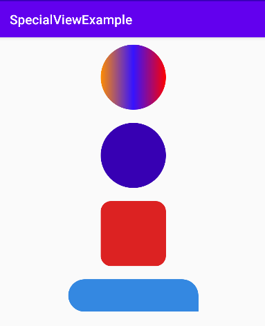

[![Contributors][contributors-shield]][contributors-url]
[![Forks][forks-shield]][forks-url]
[![Stargazers][stars-shield]][stars-url]
[![Issues][issues-shield]][issues-url]
[![MIT License][license-shield]][license-url]
[![LinkedIn][linkedin-shield]][linkedin-url]


<!-- PROJECT LOGO -->
<br />
<p align="center">
  <a href="https://github.com/birdeveloper/SpecialView">
    
  </a>

  <h3 align="center">Special Layout</h3>

  <p align="center">
    This layout will help you a lot while designing!
    <br />
    <a href="https://github.com/birdeveloper/SpecialView"><strong>Explore the docs »</strong></a>
    <br />
    <br />
    <a href="https://github.com/birdeveloper/SpecialView">View Demo</a>
    ·
    <a href="https://github.com/birdeveloper/SpecialView/issues">Report Bug</a>
    ·
    <a href="https://github.com/birdeveloper/SpecialView/issues">Request Feature</a>
  </p>
</p>


<!-- TABLE OF CONTENTS -->
## Table of Contents

* [About the Project](#about-the-project)
* [Getting Started](#getting-started)
  * [Installation](#installation)
* [Usage](#usage)
* [Problems](#problems)
* [Contributing](#contributing)
* [License](#license)
* [Contact](#contact)
* [Acknowledgements](#acknowledgements)


<!-- ABOUT THE PROJECT -->
## [About The Project](#about-the-project)

With this library you will stop creating backgrounds that are constantly drawable. Because this layout will allow you to see many things simultaneously, such as background color, radius values, gradient colors, while you design. SpecialLayout is derived from a ConstraintLayout layout.
**This library will save you from confusion while saving you time.**


<!-- GETTING STARTED -->
## [Getting Started](#getting-started)

To get a local copy up and running follow these simple steps.

### [Installation](#installation)
 
To get a Git project into your build:

**Step 1.** Add the JitPack repository to your build file
Add it in your root build.gradle at the end of repositories:
```sh
  allprojects {
    repositories {
      ...
      maven { url 'https://jitpack.io' }
    }
  }
```
**Step 2.** Add the dependency
```sh
  dependencies {
          implementation 'com.github.birdeveloper:SpecialView:1.0'
  }
```


<!-- USAGE EXAMPLES -->
## [Usage](#usage)

Android Studio can also be applied in the design section.

**1.** To create a **button**:
<br />
<a href="https://github.com/birdeveloper/SpecialView">
    
</a>

```sh
<com.birdeveloper.specialview.SpecialLayout
        android:id="@+id/specialLayout"
        android:layout_width="200dp"
        android:layout_height="50dp"
        app:color="#30DC22"
        app:shadow="false"
        app:radius="30dp"
        app:shadowAlpha="255"
        app:shadowColor="#000000">

        <TextView
            android:layout_width="wrap_content"
            android:layout_height="wrap_content"
            app:layout_constraintEnd_toEndOf="parent"
            app:layout_constraintStart_toStartOf="parent"
            app:layout_constraintBottom_toBottomOf="parent"
            app:layout_constraintTop_toTopOf="parent"
            android:textColor="#fff"
            android:text="Button" />

</com.birdeveloper.specialview.SpecialLayout>
```
<br />

**2.** To create **Round element with gradient**:

<br />
<a href="https://github.com/birdeveloper/SpecialView">
    
</a>
<br />

```sh
<com.birdeveloper.specialview.SpecialLayout
        android:id="@+id/specialLayout"
        android:layout_width="100dp"
        android:layout_height="100dp"
        app:gradientCenterColor="#3613FF"
        app:gradientEndColor="#FF0000"
        app:gradientType="linear"
        app:gradientAngle="LEFT_RIGHT"
        app:gradientStartColor="#FF8C00"
        app:radius="100dp" />
```
**gradientType values:** linear (default), sweep, radial<br />
**gradientAngle values:** LEFT_RIGHT, BOTTOM_TOP, RIGHT_LEFT, TOP_BOTTOM (default)

**3.** To create a **shape**:

<br />
<a href="https://github.com/birdeveloper/SpecialView">
    
</a>
<br />

```sh
<com.birdeveloper.specialview.SpecialLayout
        android:id="@+id/specialLayout"
        android:layout_width="100dp"
        android:layout_height="100dp"
        app:color="#DC2222"
        app:radius="16dp" />
```
**4.** To create a **message background**:

<a href="https://github.com/birdeveloper/SpecialView">
    
</a>

```sh
<com.birdeveloper.specialview.SpecialLayout
        android:id="@+id/specialLayout"
        android:layout_width="200dp"
        android:layout_height="50dp"
        app:bottomLeftRadius="100dp"
        app:bottomRightRadius="0dp"
        app:color="#3488E1"
        app:shadow="false"
        app:shadowAlpha="255"
        app:shadowColor="#000000"
        app:topLeftRadius="100dp"
        app:topRightRadius="100dp"/>
```
<!-- Problems -->
## [Problems](#problems)

See the [open issues](https://github.com/birdeveloper/SpecialView/issues) for a list of proposed features (and known issues).


<!-- CONTRIBUTING -->
## [Contributing](#contributing)

Contributions are what make the open source community such an amazing place to be learn, inspire, and create. Any contributions you make are **greatly appreciated**.

1. Fork the Project
2. Create your Feature Branch (`git checkout -b birdeveloper/SpecialView`)
3. Commit your Changes (`git commit -m 'Add some SpecialView'`)
4. Push to the Branch (`git push origin birdeveloper/SpecialView`)
5. Open a Pull Request


<!-- LICENSE -->
## [License](#license)

Distributed under the MIT License. See `LICENSE` for more information.


<!-- CONTACT -->
## [Contact](#contact)

Görkem KARA - [@gorkemkara](https://tr.linkedin.com/in/gorkemkara) - [email](mailto:birdeveloper.com@gmail.com)

Project Link: [https://github.com/birdeveloper/SpecialView](https://github.com/birdeveloper/SpecialView)


<!-- ACKNOWLEDGEMENTS -->
## [Acknowledgements](#acknowledgements)

* []()


<!-- MARKDOWN LINKS & IMAGES -->
[contributors-shield]: https://img.shields.io/github/contributors/othneildrew/Best-README-Template.svg?style=flat-square
[contributors-url]: https://github.com/birdeveloper/SpecialView/graphs/contributors
[forks-shield]: https://img.shields.io/github/forks/othneildrew/Best-README-Template.svg?style=flat-square
[forks-url]: https://github.com/birdeveloper/SpecialView/network/members
[stars-shield]: https://img.shields.io/github/stars/othneildrew/Best-README-Template.svg?style=flat-square
[stars-url]: https://github.com/birdeveloper/SpecialView/stargazers
[issues-shield]: https://img.shields.io/github/issues/othneildrew/Best-README-Template.svg?style=flat-square
[issues-url]: https://github.com/birdeveloper/SpecialView/issues
[license-shield]: https://img.shields.io/github/license/othneildrew/Best-README-Template.svg?style=flat-square
[license-url]: https://github.com/birdeveloper/SpecialView/blob/master/LICENSE.txt
[linkedin-shield]: https://img.shields.io/badge/-LinkedIn-black.svg?style=flat-square&logo=linkedin&colorB=555
[linkedin-url]: https://tr.linkedin.com/in/gorkemkara
[product-screenshot]: images/screenshot.png
